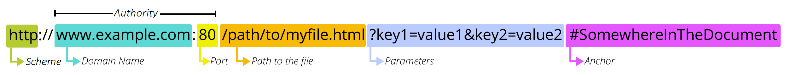

# 학습 키워드

- Express 란
- URL 구조
- REST API
- HTTP Method(CRUD)

## ✔️ 키워드 정리

### Express란

굉장히 오래된 웹 프레임워크이다.

Node.js로 무언가 만든다고 하면 가장 먼저 고려하는 프레임워크이다.
거의 모든것에 기본이 되는 프레임워크라고 생각하면 좋을 듯

쉽게 서버를 구축할 수 있고, 공식 문서도 잘 정리되어 있어서 공부하기 좋아보인다.

[Express 설치](https://expressjs.com/ko/starter/installing.html)

### URL 구조



[URL](https://developer.mozilla.org/ko/docs/Learn/Common_questions/Web_mechanics/What_is_a_URL)의 첫번째 부분인 `http`은 브라우저가 리소스를 요청하는 데 사용해야하는 프로토콜을 나타낸다. 요즘 대부분의 웹사이트는 보안 인증서가 포함되어있는 `https`를 주로 사용한다. `http`는 보완되지 않은 버전이다.

`www.example.com` 부분은 <b>Domain Name</b>이고 바로 옆에 `:80`은 <b>port</b> 부분이다.

Domain Name은 요청하는 웹 서버를 나타낸다. IP 주소가 사용될 수도 있지만 거의 사용되지 않는다.

port는 웹 서버의 리소스에 접근할 때 사용되는데 기술적인 게이트를 나타낸다. 웹 서버가 리소스에 대한 액세스 권한을 부여하기 위해 HTTP 프로토콜의 표준 포트를 사용하는 경우에는 생략 가능하다. 만약 그렇지 않다면 필수로 기재해야한다.

`/path/to/myfile.html`은 웹 서버에 있는 리소스의 경로이다.
초기에는 웹 서버의 실제 파일 위치를 나타냈는데, 요새는 대부분 웹서버가 추상적으로 처리한다.

`?key1=value1&key2=value2`은 웹 서버에 제공되는 매개변수이다. `&`로 구분된 키/값으로 봐도 된다. 웹서버는 리소스를 반환하기 전에 매개변수를 사용하여 추가 작업을 수행한 뒤 반환할 수 있다.
보통 검색을 하고 나서 URL을 확인해보면 입력해둔 검색어가 key/value 형태로 들어가있는 것을 확인할 수 있다.

마지막으로 `#SomewhereInTheDocument`부분은 `Anchor`이다.  `Anchor`는 리소스 내부에서 책갈피 역할을 하며 브라우저에 해당 지점의 콘텐츠를 표시하도록 지시한다.
하지만 # 뒤에 부분은 요청과 함께 서버로 전송되지 않는다.

### REST API

두 컴퓨터 시스템이 인터넷을 통해 정보를 안전하게 교환하기 위해 사용하는 인터페이스이다.

REST API는 Resource(URI), Verb(Http-Method), Representations으로 구성되어있다.

대부분 필딩 제약 조건 4가지를 모두 만족하지 않고, Resource와 Verb만 도입하는 수준으로 사용한다.

주로 이렇게 사용한다.

```Javascript
app.get('/products', (req, res) => {

	const products = [
		{
			category: 'Fruits', price: '$1', stocked: true, name: 'Apple',
		},
		{
			category: 'Fruits', price: '$1', stocked: true, name: 'Dragonfruit',
		},
		{
			category: 'Fruits', price: '$2', stocked: false, name: 'Passionfruit',
		},
		{
			category: 'Vegetables', price: '$2', stocked: true, name: 'Spinach',
		},
		{
			category: 'Vegetables', price: '$4', stocked: false, name: 'Pumpkin',
		},
		{
			category: 'Vegetables', price: '$1', stocked: true, name: 'Peas',
		},
	];

	res.send({ products });
});
```

### HTTP Method(CRUD)

모든 API의 기본 요청은 Get이다. 리소스를 조회하고 해당 도큐먼트에 대한 자세한 정보를 가져온다.

Post를 통해 해당 URI를 요청하여 리소스를 생성할 수 있다.
URI를 요청할 때 생성하고자 하는 정보를 JSON 형태로 같이 전달해줘야한다.

Put 또는 Patch를 통해 리소스를 수정할 수 있다.
수정하고자 하는 아이템의 idx와 정보를 JSON 형태로 전달해줘야한다.

Delete를 통해서 리소스를 삭제할 수 있다. 서버에 요청할 때 삭제하고자 하는 아이템의 idx나 특정 값을 전달해줘야한다.

## 참고

<https://velog.io/@liankim/URL%EC%9D%98-%EA%B5%AC%EC%A1%B0><br/>
<https://meetup.nhncloud.com/posts/92><br/>