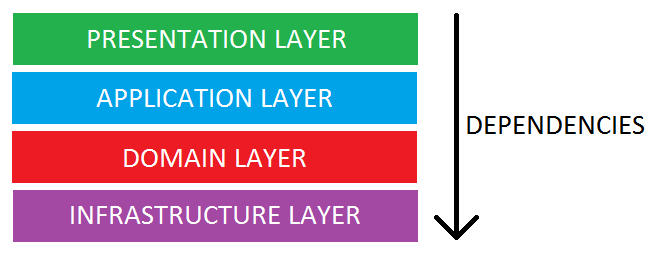
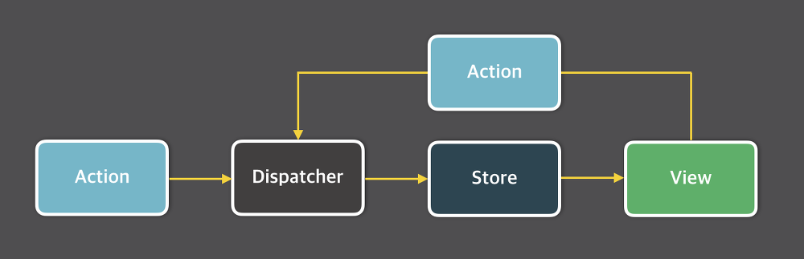

# 학습 키워드

- 관심사의 분리
- Layered Architecture
- Flux Architecture
- useReducer
- useCallback

## ✔️ 키워드 정리

### 관심사의 분리

컴퓨터 과학에서 [관심사 분리](https://ko.wikipedia.org/wiki/%EA%B4%80%EC%8B%AC%EC%82%AC_%EB%B6%84%EB%A6%AC)는 컴퓨터 프로그램을 구별된 부분으로 분리시키는 디자인 원칙으로 각 부문은 개개의 관심사를 해결한다.

관심사란 컴퓨터 프로그램 코드에 영향을 미치는 정보의 집합이다.

소프트웨어 개발에서의 관심사 분리는 특정한 관심사에 따라 기능을 나누고, 각 기능을 독립적으로 개발한 뒤 이를 조합하는 방식으로 복잡한 소프트웨어를 구성하는 것이다.

관심사 분리를 이용하면 프로그램의 설계, 디플로이, 이용의 일부 관점에 더 높은 정도의 자유도가 생긴다.

관심사가 잘 분리될 때 독립적인 개발과 업그레이드 외에도 모듈 재사용을 위한 더 높은 정도의 자유가 있다. 모듈이 인터페이스 뒤에서 이러한 관심사의 코드 부분을 개선하거나 수정할 수 있게 된다.
또, 모듈은 각각 다른 버전의 인터페이스를 노출할 수 있으며, 이를 통해 중간의 기능 손실 없이 단편적인 방식으로 복잡한 시스템을 업그레이드 하는 자유도를 높여준다.

관심사 분리는 추상화의 일종이다. 대부분의 추상화에서처럼 인터페이스의 추가는 필수이며 실행에 쓰이는 더 순수한 코드가 있는 것이 일반적이다.

관심사를 분리하면 하나의 모듈은 하나의 목적만 가지게 된다. 이 말은 곧 이 코드가 수정될 이유는 한가지만 존재하게 된다는 의미이며 진정한 의미의 소프트웨어는 변화에 유연하게 대응할 수 있어야 한다.

이처럼 관심사의 분리는 소프트웨어를 만드는 프로그래밍에서 가장 기본이 되는 원칙이다.

하나의 계층에 관심사가 여러개 존재한다면, 해당 계층의 응집도가 떨어지고 결합도가 높아진다.
각 계층들을 관심사 기준으로 분리함으로써 계층의 응집도를 높이고 결합도를 낮출 수 있다.

### Layered Architecture

Layered Architecture는 소프트웨어 개발에서 일반적으로 흔히 사용되는 아키텍쳐의 개념이다.

Layered Architecture를 사용하면 관심사의 분리를 통해 재사용성과 유지보수성을 높일 수 있다. 이로 인해 프로그램의 전체적인 시스템의 결합도를 낮출 수 있다.



Presentation Layer는 클라이언트의 요청을 받고 응답하는 계층이다.

Business Layer는 비즈니스 로직을 구현하는 부분이다. 실제로 시스템이 구현해야 하는 핵심 로직을 담당한다.
Presentation Layer로부터 사용자의 요청을 전달받고 해당 요청을 실질적으로 처리하는 부분이다.

Peraistence Layer는 데이터베이스에 접근하는 계층으로 Business의 요청 처리에 따라 데이터베이스에서 데이터를 저장, 조회, 삭제 등의 로직을 수행한다.

Database Layer는 말 그대로 데이터베이스이다.

계층화 아키텍처의 핵심요소는 단방향 의존성이다.
각각의 레이어는 오직 본인보다 하위에 있는 레이어에만 의존한다.

Layered Architecture의 구조로 코드를 구현하면 각 레이어가 독립적이고 역할이 분명하므로 코드의 확장성이 높아지기 때문에 코드의 구조를 파악하기 쉬울 뿐만 아니라 재사용성도 높아진다.
또한 역할이 명확하게 나뉘어져 있어서 테스트 코드의 작성이 수월하다는 장점을 가진다.

### Flux Architecture

Flux 구조의 가장 큰 특징은 단방향 데이터 흐름이다.


데이터의 흐름은 디스패쳐 => 스토어 => 뷰 순서로 되어 있으며 뷰에서 입력이 발생하면 액션을 통해서 디스패쳐로 향하게 된다.

`Dispatcher`는 Flux 애플리케이션의 모든 데이터 흐름을 관리하는 일종의 허브 역할을 한다.
`Action`이 발생하면 `Dispatcher`로 메세지나 `Action` 객체가 전달되고 `Dispatcher`에서는 이러한 메시지나 `Action` 객체를 콜백 함수를 통해 `Store`로 전달한다.

`Dispatcher`를 통해 `Store`에 변화를 일으킬 수 있는데 이때 `Dispatcher`의 묶음을 `Action`이라고 한다.

`Store`는 애플리케이션의 상태를 저장한다. 모든 상태 변경은 `Store`에 의해 결정되며 상태 변경을 위한 요청을 `Store`에 직접 할 수는 없다. 상태 변경을 위해서는 꼭 `Action`생성자를 통해 `Dispatch`단계를 거친 후 `Action`을 보내야만 상태값 변경이 가능하다.

`View`는 상태를 가져와서 보여주고 사용자로부터 입력 받을 화면을 보여준다. 컨트롤러 뷰는 스토어와 뷰의 중간 관리자 같은 역할을 하고 스토어에서 상태 값 변경이 일어났을 때 스토어는 컨트롤러 뷰에서 전달하고 컨트롤러 뷰는 자신 아래에 있는 모든 뷰에게 새로운 상태를 넘겨준다.

### useReducer

useState처럼 state를 생성, 관리를 할 수 있도록 도와준다.
state가 많고 복잡할 때 useReducer를 사용하면 코드를 깔끔하게 사용할 수 있고 유지보수에도 도움이 된다.

useReducer를 사용하여 state를 업데이트 하기 위해서는 dispatch 함수를 사용하여 업데이트 시킬 수 있다.
dispatch는 어떤 state를 어떻게 바꿀지에 대한 내용만 명시해주면 된다.
dispatch에서 적어준 내용에 대한 처리는 reducer 함수에서 처리하도록 하면 된다.

useReducer의 기본 형태는 이렇다.

```Javascript
const [state, dispatch] = useReducer(reducer, initialState);
```

dispatch를 사용하면 reducer에서 처리해주고, state를 사용하면 initialState에 넣어놓은 state에 접근할 수 있다.

### useCallback

useCallback은 함수를 메모이제이션하기 위해서 사용되는 훅이다.
리액트의 useCallback은 useEffect와 비슷하게 생겼지만 역할이 조금 다르다.

useCallback은 메모이제이션 기법을 사용하여 컴포넌트의 성능을 최적화 시켜주는 도구이다.
인자로 전달한 콜백 함수를 메모이제이션한다.

useCallback은 이렇게 사용한다.

```Javascript
const calculate = useCallback((num) => {
    return num + 1;
}, [item])
```

calculate 함수는 메모이제이션된 함수를 갖고 있게 된다.
메모이제이션 된 calculate 함수는 의존성 배열 내부에 있는 값이 변경되지 않는 이상 다시 초기화 되지 않는다.
만약, 의존성 배열 내부의 값이 변경된다면 calculate 함수는 새로 만들어진 함수 객체로 초기화 된다.

## 참고

<https://taak-e.tistory.com/entry/%EA%B4%80%EC%8B%AC%EC%82%AC%EC%9D%98%EB%B6%84%EB%A6%AC-%EB%A6%AC%EC%95%A1%ED%8A%B8%EC%97%90%EC%84%9C-SoC-CustomHook><br/>
<https://teamdable.github.io/techblog/SoC-to-IoC><br/>
<https://delivan.dev/react/stop-asking-if-react-hooks-replace-redux-kr/><br/>
<https://velog.io/@hjthgus777/React-%EB%8B%A4%EC%8B%9C-%ED%95%9C%EB%B2%88-useCallback%EC%9D%84-%ED%8C%8C%ED%97%A4%EC%B3%90%EB%B3%B4%EC%9E%90><br/>
<https://5kdk.tistory.com/39>