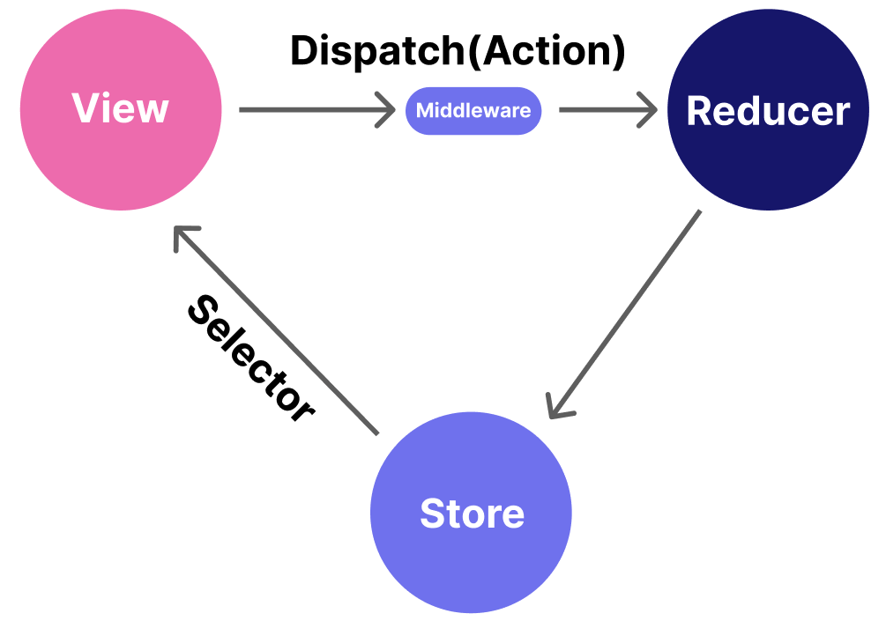

# 학습 키워드

- Redux
- Reflect

## ✔️ 키워드 정리

### Redux



리덕스는 여러 컴포넌트가 공유하는 상태를 관리하기 위한 라이브러리로 메타가 설계한 flux 규격에 맞추어져 있다.
리액트와 사용하기 위해서는 React Tool Kit을 함께 설치해야 한다.

대략적인 사용 예시는 이렇다.

```Javascript
const dispatch = useDispatch();
const count = useSelector((state) => state.count);

dispatch({ type: 'increase' });
dispatch({ type: 'decrease' });

dispatch({ type: 'increase', payload: 10 });
```


📋 Redux로 변경하기 [TSyringe 코드 참고](/week6/TSyringe.md)

```Javascript
// CounterStore.ts
import {singleton} from 'tsyringe';

type Listener = () => void;

@singleton()
export default class CounterStore{
  count = 0;

  listeners: new Set<Listener>();

  increase() {
    this.count += 1;
    this.publish();
  }

  decrease() {
    this.count -= 1;
    this.publish();
  }

  publish() {
    this.listeners.forEach((listener) => {
      listener();
    });
  }

  addListener(listener: Listener) {
    this.listeners.add(listener);
  }

  removeListener(listener: Listener) {
    this.listeners.delete(listener);
  }
}

// Store.ts
import {singleton} from 'tsyringe';
import BaseStore, {Action} from './BaseStore';

// type State = {  타입 선언을 할 수 있는 방법 1번째
//   count: number;
// }

  const initialState = {
    count: 0,
    // name: ''
  };

export type State = typeof initialState;  // 타입 선언을 할 수 있는 방법 2번째

function reducer(state:State, action:Action){
  switch (action.type) {
    case "increase":
      return {
        ...state,
        count: state.count + 1
      };
    case "decrease":
      return {
        ...state,
        count: state.count - 1
      };
    default:
      return state;
  }
}

@singleton()
export default class Store extends BaseStore{
  constructor() {
    super(initialState, reducer);
  }
}

// BaseStore.ts
import {singleton} from 'tsyringe';

export type Action = {
  type: string;
}

type Reducer<State> = (state:State, action: Action) => State;

type Listener = () => void;

@singleton()
export default class BaseStore<State>{
  state: State;

  reducer = Reducer;

  listeners: new Set<Listener>();

  constructor(initialState:State, reducer: Reducer<State>){
    this.state = initialState;
    this.reducer = reducer
  }

  dispatch(action: Action){
    this.state = this.reducer(this.state, action);
    this.publish();
  }

  publish() {
    this.listeners.forEach((listener) => {
      listener();
    });
  }

  addListener(listener: Listener) {
    this.listeners.add(listener);
  }

  removeListener(listener: Listener) {
    this.listeners.delete(listener);
  }
}

// useForceUpdate.ts
import {useState, useCallback} from 'react';

export default function useForceUpdate(){
  const [_, setState] = useState({});
  return useCallback(() => setState({}), [])
}

// useCounterStore
import {useEffect} from 'react';
import {container} from 'tsyringe';

import useForceUpdate from '../hooks/useForceUpdate';
import CounterStore from '../stores/CounterStore';

export default function useCounterStore() {
  const store = container.resolve(CounterStore);
  const forceUpdate = useForceUpdate();

  useEffect(() => {
    store.addListener(forceUpdate);

    return () => {
      store.removeListener(forceUpdate);
    }
  }, [store, forceUpdate])

  return store;
}

// useStore
import {useEffect} from 'react';
import {container} from 'tsyringe';

import useForceUpdate from '../hooks/useForceUpdate';
import Store from '../stores/Store';

export default function useStore() {
  const store = container.resolve(Store);
  const forceUpdate = useForceUpdate();

  useEffect(() => {
    store.addListener(forceUpdate);

    return () => {
      store.removeListener(forceUpdate);
    }
  }, [store, forceUpdate])
}

// Counter.tsx
import useStore from '../hooks/useStore';

export default function Counter() {
  const store = useStore();
  const {state} = store;

  return (
    <div>
      <p>
      Count:
      {' '}
      {state.count}
      </p>
    </div>
  )
}

// CounterControl.tsx
import useStore from '../hooks/useStore';

export default function CountControl(){
  const store = useStore();
  const {state} = store;
  const handleClickIncrease = () => {
    store.dispatch({type: 'increase'})
  }

  const handleClickDecrease = () => {
    store.dispatch({type: 'decrease'})
  }

  return (
    <div>
      <p>{state.count}</p>
      <button type="button" onClick={handleClickIncrease}>
        Increase
      </button>
       <button type="button" onClick={handleClickDecrease}>
        Decrease
      </button>
    </div>
  )
}
```

`dispatch`와 `action`을 분리해서 사용하고 싶다면 이렇게 변경하면 된다.

```Javascript
// CounterControl.tsx
import useDispatch from '../hooks/useDispatch';
import useSelector from '../hooks/useSelector';

import {increase, decrease} from '../stores/Store';

export default function CountControl(){
  const dispatch = useDispatch();
  const count = useSelector((state) => state.count);
  // const countAndName = useSelector((state)=> ({ 이렇게도 사용할 수 있음
  //   count: state.count,
  //   name: state.name
  // }));

  return (
    <div>
      <p>{count}</p>
      <button type="button" onClick={()=> dispatch(increase())}>
        Increase
      </button>
      <button type="button" onClick={()=> dispatch(increase(10))}>
        Increase 10
      </button>
       <button type="button" onClick={() => dispatch(decrease())}>
        Decrease
      </button>
      <button type="button" onClick={() => dispatch(decrease(10))}>
        Decrease 10
      </button>
    </div>
  )
}

// useDispatch.ts
import {container} from 'tsyringe';
import {Action} from '../stores/BaseStore';
import Store from '../stores/Store';

export default function useDispatch<Payload>(){
  const store = container.resolve(Store);
  return (action: Action<Payload>) => store.dispatch(action)
}

// useSelector.ts  **useStore 삭제
import {container} from 'tsyringe';
import {useRef, useEffect} from 'react';
import Store, {State} from '../stores/Store';
import useForceUpdate from './useForceUpdate';

export default function useSelector<T>(selector:Selector<T>) {
  const store = container.resolve(Store);
  const state = useRef(selector(store.state));
  const forceUpdate = useForceUpdate();

  useEffect(() => {
    const update = () => {
      const newState = selector(store.state);

      if (newState !== state.current) {
        forceUpdate();
        state.current = newState;
      }
    };
    store.addListener(update);

    return () => store.removeListener(update);
  }, [store, forceUpdate])

  selector(store.state);
}

// Counter.tsx
import useSelector from '../hooks/useSelector';

export default function Counter() {
  const count = useSelect((state) => state.count);

  return (
    <div>
      <p>
      Count:
      {' '}
      {count}
      </p>
    </div>
  )
}

// Store.ts
import {singleton} from 'tsyringe';
import BaseStore, {Action} from './BaseStore';

// type State = {  타입 선언을 할 수 있는 방법 1번째
//   count: number;
// }

  const initialState = {
    count: 0,
    name: 'Tester'
  };

export type State = typeof initialState;  // 타입 선언을 할 수 있는 방법 2번째

const reducers = {
  increase(state:State, action:Action<number>) {
    return {
      ...state,
      count: state.count + (action.payload ?? 1)
    };
  },
 decrease(state:State, action:Action<number>) {
    return {
      ...state,
      count: state.count - (action.payload ?? 1)
    };
  }
}


// dispatch 분리할 때 추가할 함수
export function increase(step?: number){
  return {type: 'increase', payload: step}
}

export function decrease(){
  return {type: 'decrease'}
}

@singleton()
export default class Store extends BaseStore{
  constructor() {
    super(initialState, reducers);
  }
}


// BaseStore.ts
import {singleton} from 'tsyringe';

export type Action<Payload> = {
  type: string;
  payload?: Payload
}

type Reducer<State, Payload> = (state:State, action: Action<Payload>) => State;
type Reducers<State> = Record<string, Reducer<State, any>>;

type Listener = () => void;

@singleton()
export default class BaseStore<State>{
  state: State;

  reducer = Reducer<State, any>;

  listeners: new Set<Listener>();

  constructor(initialState:State, reducer: Reducers<State>){
    this.state = initialState;
    this.reducer = (state:State, action:Action<unknown>) => {
      const reducer = Reflect.get(reducers,action.type);

      if (!reducer) {
        return state
      }

      return reducer(state, action)
    }
  }

  dispatch(action: Action<any>){
    this.state = this.reducer(this.state, action);
    this.publish();
  }

  publish() {
    this.listeners.forEach((listener) => {
      listener();
    });
  }

  addListener(listener: Listener) {
    this.listeners.add(listener);
  }

  removeListener(listener: Listener) {
    this.listeners.delete(listener);
  }
}


// NameCard.tsx
import {useEffect} from 'react';
import useSelector from '../hooks/useSelector';

export default function NameCard(){
  const name = useSelector((state) => state.name);

  useEffect(()=> {
    console.log('render NameCard Component');
  })

  return (
    <div>
      <p>
        Name:
        {' '}
        {name}
      </p>
    </div>
  )
}

```

### Reflect

[Reflect](https://developer.mozilla.org/ko/docs/Web/JavaScript/Reference/Global_Objects/Reflect)는 중간에서 가로챌 수 있는 Javascript 작업에 대한 메서드를 제공하는 내장 객체이다.

다른 대부분의 전역 객체와 다르게, `Reflect`는 생성자가 아니다. 따라서 함수처럼 호출하거나 new 연산자로 인스턴스를 만들 수 없다.
Math 객체처럼, `Reflect`의 모든 속성과 메서드는 정적이다.

`Reflect` 객체의 정적 메서드 이름은 프록시 처리기 메서드의 이름과 같다.

`Reflect.get()`함수는 대상의 속성을 반환하는 함수이다.

이 외에도 다양한 함수들이 내장되어 있어서 유용하게 사용될 것 같다.